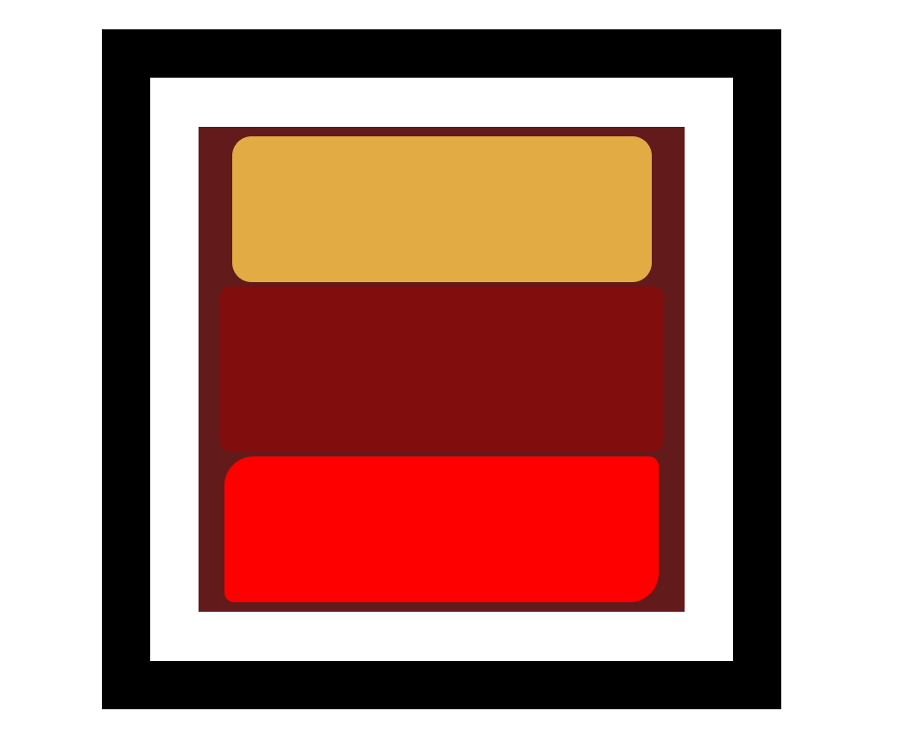

# 📦 Box Model Project — HTML & CSS

This is a simple beginner-friendly project to demonstrate the **CSS Box Model** concept using pure HTML and CSS. It’s part of my journey to master Web Development, one small project at a time 🚀

---

## 🚀 Live Site

🔗 [Click here to see the live demo](https://nancy-jaiswal19.github.io/box-model-html-css/)

---

## 📚 What This Project Covers

- HTML structure and semantic tags
- CSS Box Model: `margin`, `border`, `padding`, `content`
- Styling elements with external CSS
- How box spacing works on the web
- Pushing a project to GitHub using GitHub Desktop
- Hosting projects with GitHub Pages

---

## 🖼️ Screenshot

---

## 📁 Folder Structure

box-model-html-css/
├── docs/
│ └── Screenshot.png
│ ├── index.html
│ ├── style.css
├── README.md

---

## 🧑‍💻 Author

**Nancy Jaiswal**  
[GitHub Profile](https://github.com/nancy-jaiswal19)  

---

## 💡 Future Plans

- Add responsive design using media queries
- Include hover effects to make it interactive
- Try rebuilding this layout using Flexbox and Grid

---

